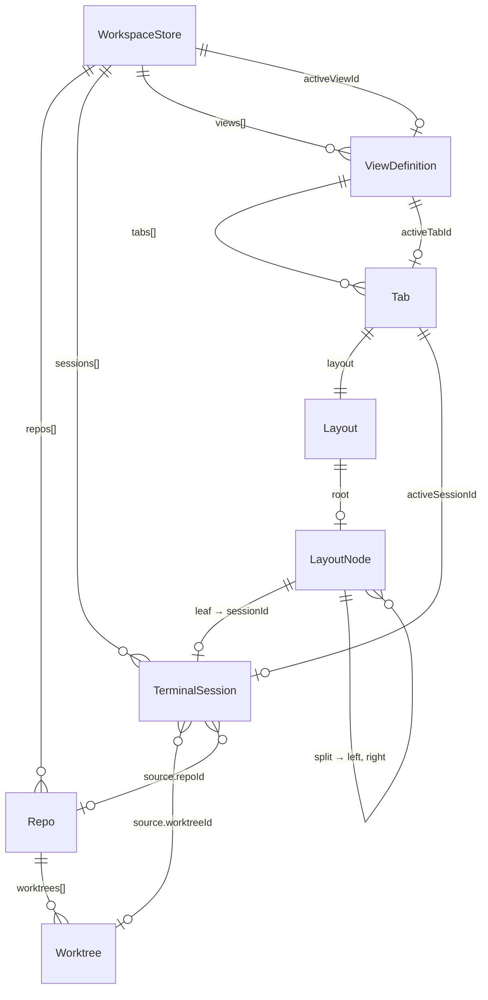
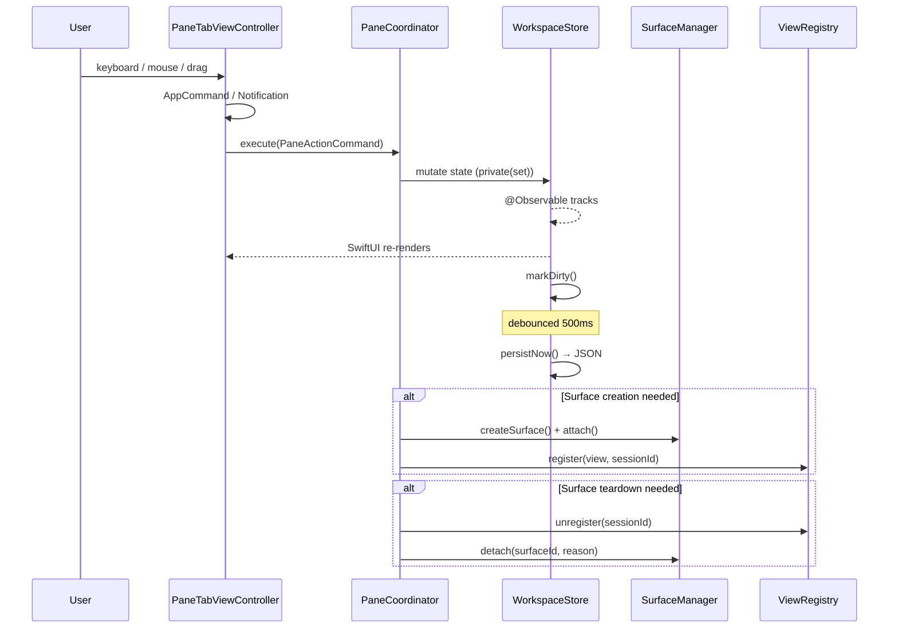
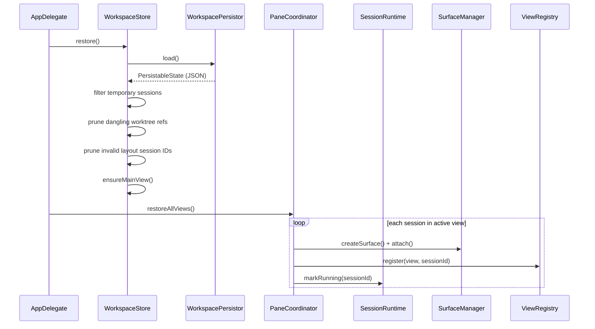

# Component Architecture

## TL;DR

State is distributed across independent `@Observable` stores (Jotai-style atomic stores) with `private(set)` for unidirectional flow (Valtio-style). `WorkspaceStore` owns workspace structure, `SurfaceManager` owns Ghostty surfaces, `SessionRuntime` owns backends. A coordinator sequences cross-store operations. `Pane` is the primary identity — referenced by UUID across every layer. Layouts are immutable value-type trees where leaves point to pane IDs. `@Observable` drives SwiftUI re-renders; persistence is debounced. Twelve invariants are enforced at all times.

---

## 1. Overview

### 1.1 Architecture Principles

1. **Pane identity is primary; terminal sessions are a specialization** — `PaneId` is the cross-feature identity contract. For terminal panes, a `TerminalSession` continues to exist independently of layout, view, or surface and can move between tabs, views, and layout positions while keeping identity.
2. **Atomic stores (Jotai-style)** — Each domain has its own `@Observable` store. `WorkspaceStore` owns workspace structure (tabs, layouts, views). `SurfaceManager` owns Ghostty surfaces. `SessionRuntime` owns backends. No god-store — each store has one domain, one reason to change, testable in isolation.
3. **Unidirectional flow (Valtio-style)** — All store state is `private(set)`. External code reads freely, mutates only through store methods. No action enums, no reducers — the compiler enforces the boundary.
4. **Coordinator for cross-store sequencing** — A coordinator sequences operations across multiple stores for a single user action. Owns no state, contains no domain logic. If a coordinator method contains an `if` that decides what to do with domain data, that logic belongs in a store.
5. **Explicit layout model** — The split tree is a structured, queryable `Layout` value type. Leaves reference sessions by ID. No `NSView` references, no opaque blobs.
6. **View model** — Multiple named `ViewDefinition`s organize sessions into tab arrangements. Switching views reattaches surfaces without recreation.
7. **Surface independence** — Ghostty surfaces are ephemeral runtime resources. The model layer never holds `NSView` references.
8. **Provider abstraction** — zmx is a headless restore backend. The model carries provider metadata without coupling to zmx specifics.
9. **AsyncStream over Combine/NotificationCenter** — All new event plumbing uses `AsyncStream` + `swift-async-algorithms`. Existing Combine/NotificationCenter migrated incrementally.
10. **Testability** — Core model and layout logic are pure value types. Injectable `Clock` for time-dependent logic. No real delays in tests.

Clock migration note (target pattern, not fully complete yet): remaining production `Task.sleep` call sites are in
`MainSplitViewController` and `AppDelegate`. Store-level time-dependent paths in `WorkspaceStore`, `SessionRuntime`,
and `SurfaceManager` have been migrated to injected clocks in this branch. The target is
constructor-injected clocks (`any Clock<Duration>`) for all store-level time-dependent behavior.

Configuration injection pattern: prefer constructor injection with defaults over mutable configuration vars. Example:
`init(clock: any Clock<Duration> = ContinuousClock(), ...)` and `private let` configuration fields.

### 1.2 High-Level System Diagram

```
┌──────────────────────────────────────────────────────────────────────┐
│                            AppDelegate                               │
│                                                                      │
│   Persisted State            Runtime                   UI Bridge     │
│  ┌──────────────┐    ┌───────────────┐    ┌──────────────────────┐   │
│  │WorkspaceStore│    │SessionRuntime │    │    ViewRegistry       │   │
│  │ repos        │    │ statuses      │    │ sessionId → NSView   │   │
│  │ sessions     │◄───│ backends      │    │ renderTree()         │   │
│  │ views        │    └───────┬───────┘    └──────────┬───────────┘   │
│  │ activeViewId │            │                       │               │
│  └──────┬───────┘            │                       │               │
│         │            ┌───────┴───────────────────────┴────────┐      │
│         │            │      PaneCoordinator            │      │
│         │            │   (sole bridge: model ↔ view ↔ surface) │      │
│         │            └───────────────────┬────────────────────┘      │
│         │                                │                           │
│  ┌──────┴──────┐                ┌────────┴────────┐                  │
│  │   Action    │                │ SurfaceManager  │                  │
│  │  Executor   │                │   (singleton)   │                  │
│  │ (dispatch)  │                │ active|hidden   │                  │
│  └─────────────┘                │ |undoStack      │                  │
│                                 └─────────────────┘                  │
│  ┌─────────────┐  ┌────────────┐  ┌──────────────┐                  │
│  │TabBarAdapter│  │ Persistor  │  │WorktrunkSvc  │                  │
│  │(derived UI) │  │ (JSON I/O) │  │(git worktree)│                  │
│  └─────────────┘  └────────────┘  └──────────────┘                  │
└──────────────────────────────────────────────────────────────────────┘
```

---

## 2. Data Model

### 2.1 Entity Relationship Overview



### 2.2 Repo & Worktree

Models are split across two stores. See [Workspace Data Architecture](workspace_data_architecture.md) for the full persistence tier spec and enrichment pipeline.

**`Repo`** — A git repository on disk. Structure-only — no enrichment data.

| Field | Type | Notes |
|-------|------|-------|
| `id` | `UUID` | Primary key |
| `name` | `String` | Directory name |
| `repoPath` | `URL` | Filesystem path |
| `worktrees` | `[Worktree]` | Git worktrees (each has explicit repoId FK) |
| `createdAt` | `Date` | When the repo was added |
| `stableKey` | `String` | SHA-256 of path, derived, deterministic across reinstalls |

**`Worktree`** — A git worktree within a repo. Structure-only.

| Field | Type | Notes |
|-------|------|-------|
| `id` | `UUID` | Primary key |
| `repoId` | `UUID` | FK to parent Repo |
| `name` | `String` | Display name |
| `path` | `URL` | Filesystem path |
| `isMainWorktree` | `Bool` | Whether this is the main checkout |
| `stableKey` | `String` | SHA-256 of path, derived |

All enrichment (branch, git status, origin, PR counts) lives in `WorkspaceRepoCache`, populated by the event bus. See the "Three Persistence Tiers" section in workspace_data_architecture.md.

> **Files:** `Core/Models/Repo.swift`, `Core/Models/Worktree.swift`

### 2.3 TerminalSession

The **primary entity**. Stable identity for a terminal, independent of layout position, view, or surface. The `id` (UUID) is used across every layer: `WorkspaceStore`, `Layout`, `ViewRegistry`, `SurfaceManager`, `SessionRuntime`.

| Field | Type | Notes |
|-------|------|-------|
| `id` | `UUID` | Immutable primary key, never changes |
| `source` | `TerminalSource` | What this terminal is for |
| `title` | `String` | Display title (updated from shell) |
| `content` | `PaneContent` | What this pane displays (terminal, bridge, webview) |
| `provider` | `SessionProvider` | Backend type |
| `lifetime` | `SessionLifetime` | Persistence behavior |
| `residency` | `SessionResidency` | Lifecycle position |

**`TerminalSource`** — What the terminal is for:
- `.worktree(worktreeId: UUID, repoId: UUID)` — Terminal for a specific worktree. References are **metadata, not foreign keys**: the session survives worktree removal; UI shows fallback text.
- `.floating(workingDirectory: URL?, title: String?)` — Standalone terminal not tied to a worktree.

**`SessionProvider`** — Backend type:
- `.ghostty` — Direct Ghostty surface, no session multiplexer
- `.zmx` — Headless zmx backend for persistence/restore across app restarts

**`SessionLifetime`** — Whether the session survives app restart:
- `.persistent` — Saved to disk and restored on launch. Temporary sessions are filtered out during save and restore.
- `.temporary` — Ephemeral, never persisted.

**`SessionResidency`** — Where the session currently lives in the app lifecycle. Prevents false-positive orphan detection:
- `.active` — In a layout, view exists, fully visible
- `.pendingUndo(expiresAt: Date)` — Closed but in the undo window. Not an orphan.
- `.backgrounded` — Alive but not visible in the current view. Not an orphan.

> **Files:** `Core/Models/TerminalSource.swift`, `Core/Models/SessionLifetime.swift`, `Core/Models/SessionResidency.swift`

#### Session → Pane Identity Reconciliation

This document uses session-centric naming (`TerminalSession`, `sessionId`) because that reflects the current codebase. The [Pane Runtime Architecture](pane_runtime_architecture.md) introduces pane-centric naming (`PaneId`, `PaneMetadata`, `PaneRuntime`) as the generalized abstraction for any pane type (terminal, browser, diff viewer, editor). The canonical identity contract is in [Session Lifecycle — Identity Contract (Canonical)](session_lifecycle.md#identity-contract-canonical).

The relationship is:

| Current (session-centric) | Target (pane-centric) | Notes |
|---|---|---|
| `TerminalSession.id` | `PaneId` (= `UUID`) | A terminal session's ID is one instance of a PaneId |
| `TerminalSource` | `PaneSource` (in `PaneMetadata`) | Generalized: `.worktree`, `.floating`, `.url`, `.artifact` |
| `SessionRuntime` | Coexists with `PaneRuntime` | `SessionRuntime` tracks zmx backend health; `PaneRuntime` is the per-pane event/command protocol. Different concerns. |
| `ViewRegistry` (sessionId → NSView) | Coexists with `RuntimeRegistry` (paneId → PaneRuntime) | ViewRegistry maps to NSViews; RuntimeRegistry maps to runtime protocol instances. Both keyed by the same UUID. |
| `SurfaceManager` | Internal to `GhosttyAdapter` / terminal feature | Surface lifecycle is terminal-specific, not generic to all pane types |

This is an evolutionary relationship, not a replacement. `TerminalSession` and `SessionRuntime` continue to exist in the current code. As non-terminal pane types are implemented (LUNA-349), the pane-centric contracts in `Core/PaneRuntime/` become the shared abstraction layer, and terminal-specific models specialize under `Features/Terminal/`.

### 2.4 ViewDefinition & ViewKind

A **named arrangement** of sessions into tabs. Multiple views can reference the same sessions.

| Field | Type | Notes |
|-------|------|-------|
| `id` | `UUID` | Primary key |
| `name` | `String` | Display name |
| `kind` | `ViewKind` | Lifecycle/behavior type |
| `tabs` | `[Tab]` | Ordered tab array (position = index) |
| `activeTabId` | `UUID?` | Currently focused tab |
| `allSessionIds` | `[UUID]` | Derived: all session IDs across all tabs |

**`ViewKind`** — Determines lifecycle and behavior:
- `.main` — Default view, always exists, cannot be deleted
- `.saved` — User-persisted layout snapshot
- `.worktree(worktreeId: UUID)` — Auto-generated view for a specific worktree
- `.dynamic(rule: DynamicViewRule)` — Rule-based, resolved at runtime

**`DynamicViewRule`** — Rules for dynamic views:
- `.byRepo(repoId: UUID)` — All sessions for a repo
- `.byCWD` — All panes grouped by working directory
- `.custom(name: String)` — Future: user-defined filter

> **File:** `Core/Models/DynamicView.swift`

### 2.5 Tab

A tab within a view. Contains a layout and tracks which session is focused. Order is implicit — array position in the parent `ViewDefinition.tabs`.

| Field | Type | Notes |
|-------|------|-------|
| `id` | `UUID` | Primary key |
| `layout` | `Layout` | Split tree of session references |
| `activeSessionId` | `UUID?` | Focused session within this tab |
| `sessionIds` | `[UUID]` | Derived: all leaf session IDs (left-to-right) |
| `isSplit` | `Bool` | Derived: true if layout root is a split |

> **File:** `Core/Models/Tab.swift`

### 2.6 Layout (Pure Value Type)

An immutable binary split tree. Leaves reference sessions by ID. All operations return **new** `Layout` instances — no in-place mutation.

```
Layout
└── root: Node?
    ├── .leaf(sessionId: UUID)
    └── .split(Split)
        ├── id: UUID
        ├── direction: .horizontal | .vertical
        ├── ratio: Double  (clamped 0.1–0.9)
        ├── left: Node
        └── right: Node
```

**Immutable Operations** (all return new Layout):

| Operation | Description |
|-----------|-------------|
| `inserting(sessionId:at:direction:position:)` | Insert a session adjacent to a target |
| `removing(sessionId:)` | Remove a session; collapses single-child splits. Returns `nil` if layout becomes empty |
| `resizing(splitId:ratio:)` | Update a split's ratio |
| `equalized()` | Set all split ratios to 0.5 |

**Navigation:**

| Method | Description |
|--------|-------------|
| `neighbor(of:direction:)` | Find the session in the given direction (left/right/up/down) |
| `next(after:)` | Next session in left-to-right order (wraps) |
| `previous(before:)` | Previous session in left-to-right order (wraps) |

> **File:** `Core/Models/Layout.swift`

### 2.7 Templates

Templates define the initial session layout when opening a worktree. Not yet wired into the main flow (Phase B6, future).

**`TerminalTemplate`** — Blueprint for a single session:
- `title`, `agent`, `provider`, `relativeWorkingDir`
- `instantiate(worktreeId:repoId:)` → `TerminalSession`

**`WorktreeTemplate`** — Blueprint for a multi-session tab:
- `terminals: [TerminalTemplate]`, `createPolicy`, `splitDirection`
- `instantiate(worktreeId:repoId:)` → `([TerminalSession], Tab)`

**`CreatePolicy`** — When templates auto-create sessions:
- `.onCreate` — When the worktree is first opened
- `.onActivate` — When the worktree view is activated
- `.manual` — Only on explicit user action

> **File:** `Core/Models/Templates.swift`

---

## 3. Service Layer

### 3.1 Ownership Hierarchy

```
AppDelegate (creates all services in dependency order)
├── WorkspaceStore           ← workspace structure (atomic store)
├── SessionRuntime           ← backend status tracking (zmx health)
├── ViewRegistry             ← paneId → NSView mapping
├── PaneCoordinator          ← action dispatch + model↔view↔surface orchestration
│                               + RuntimeRegistry owner + event stream consumer (LUNA-325)
├── TabBarAdapter            ← derived display state
├── CommandBarPanelController ← command bar lifecycle (⌘P)
└── MainWindowController
    └── MainSplitViewController
        └── PaneTabViewController
            ├── DraggableTabBarHostingView (SwiftUI)
            └── terminalContainer (dynamic split hierarchy)

Core/PaneRuntime/ (shared pane-runtime domain):
├── PaneRuntime protocol     ← per-pane runtime contract
├── RuntimeRegistry          ← paneId → runtime lookup (owned by PaneCoordinator)
├── NotificationReducer      ← priority-aware event delivery
├── EventReplayBuffer        ← bounded replay for late-joining consumers
├── PaneRuntimeEvent         ← typed event vocabulary (GhosttyEvent, BrowserEvent, etc.)
└── RuntimeCommand           ← typed command vocabulary (TerminalCommand, BrowserCommand, etc.)

Singletons:
├── SurfaceManager.shared    ← Ghostty surface lifecycle
├── GhosttyAdapter.shared    ← C FFI boundary, routes to per-pane TerminalRuntime (LUNA-325)
├── CommandDispatcher.shared ← command definitions + dispatch
├── WorktrunkService.shared  ← git worktree CLI
└── Ghostty.shared           ← Ghostty C API wrapper
```

> **Testability note on singletons:** These `static let shared` singletons are `@MainActor` (inferred or explicit). Under Swift 6.2, `static var` on `@MainActor` types is also MainActor-isolated (enforced since Swift 5.10). This is fine for production — they don't cross actor boundaries. However, `static let` cannot be swapped for testing. When boundary actors need these services (e.g., `FilesystemActor` needing `WorktrunkService` for worktree path resolution, or `ForgeActor` needing `ProcessExecutor` for git CLI), **inject via constructor parameter**, not via `.shared` access from inside the actor. The EventBus design already follows this pattern: `private let bus: EventBus<RuntimeEnvelope>` is constructor-injected. Apply the same to any singleton that a non-MainActor component needs.

### 3.2 WorkspaceStore

Owns all workspace structure state. `@Observable`, `@MainActor`. All properties are `private(set)` — external code mutates only through methods.

**Observable state** (drives SwiftUI via `@Observable` property tracking):
- `repos: [Repo]`, `sessions: [TerminalSession]`, `views: [ViewDefinition]`, `activeViewId: UUID?`
- Transient UI: `draggingTabId`, `dropTargetIndex`, `tabFrames`

Transient UI binding exception: `draggingTabId`, `dropTargetIndex`, `tabFrames`, and `isSplitResizing` are view-layer
interaction state and are intentionally writable by UI bindings. They are not domain state and do not relax the
`private(set)` boundary for domain-owned store data.

**Mutation API categories:**

| Category | Methods |
|----------|---------|
| Session | `createSession()`, `removeSession()`, `updateSessionTitle()`, `updateSessionAgent()`, `setResidency()` |
| View | `switchView()`, `createView()`, `deleteView()`, `saveCurrentViewAs()` |
| Tab | `appendTab()`, `removeTab()`, `insertTab()`, `moveTab()`, `setActiveTab()` |
| Layout | `insertPane()`, `removePaneFromLayout()`, `resizePane()`, `equalizePanes()`, `setActivePane()` |
| Compound | `breakUpTab()`, `extractSession()`, `mergeTab()` |
| Repo | `addRepo()`, `removeRepo()`, `updateRepoWorktrees()` |

**Derived state** (computed, not stored):
- `activeView`, `activeTabs`, `activeTabId`, `activeSessionIds`
- `isWorktreeActive()`, `sessionCount(for:)`, `sessions(for:)`

> **File:** `Core/Stores/WorkspaceStore.swift`

### 3.3 SessionRuntime

Manages live session state. Does **not** own sessions — reads the session list from `WorkspaceStore`. Tracks runtime status per session, schedules health checks, coordinates backends. `@Observable`, `@MainActor`.

**Runtime status:** `SessionRuntimeStatus` — `.initializing`, `.running`, `.exited`, `.unhealthy`

**Backend protocol:** `SessionBackendProtocol` — `start()`, `isAlive()`, `terminate()`, `restore()`

**Key operations:**
- `registerBackend()` — Register a backend (e.g., `ZmxBackend`) for a provider type
- `syncWithStore()` — Align tracked sessions with store's session list
- `startHealthChecks()` / `runHealthCheck()` — Periodic backend liveness checks
- `startSession()` / `restoreSession()` / `terminateSession()` — Backend lifecycle

> **Note:** A full `SessionStatus` state machine (7 states: unknown, verifying, alive, dead, missing, recovering, failed) exists in `Models/StateMachine/SessionStatus.swift` for future zmx health integration but is not yet wired into `SessionRuntime`. See [Session Lifecycle](session_lifecycle.md) for details.
>
> `ZmxBackend` conforms to a separate `SessionBackend` protocol (defined in `ZmxBackend.swift`) with its own method signatures. A future phase will wire `SessionRuntime` → `ZmxBackend` and consolidate the two protocols.
>
> **Isolation audit:** `ZmxBackend.isAlive()` shells out to the `zmx` CLI — this is 10-100ms of blocking I/O. Since `SessionRuntime` is `@MainActor`, `isAlive()` must not run synchronously on the main thread. The current implementation dispatches via `ProcessExecutor` (which uses `DispatchQueue.global()`). When the backend protocol is consolidated, `isAlive()` should be `@concurrent nonisolated` (Swift 6.2) to explicitly run on the cooperative pool. Plain `nonisolated async` would inherit MainActor isolation if called from `SessionRuntime` — see [EventBus Design — Swift 6.2 Gotchas](pane_runtime_eventbus_design.md#swift-62-gotchas-quick-reference).

> **File:** `Core/Stores/SessionRuntime.swift`

### 3.4 ViewRegistry

Maps pane IDs to live `PaneHostView` instances. Runtime-only (not persisted). `@MainActor`.

- `register(view, paneId)` / `unregister(paneId)` — View lifecycle
- `view(for: paneId)` — Host lookup
- typed mount accessors — Resolve mounted content when callers need pane-kind-specific behavior
- `renderTree(for: Layout) -> PaneSplitTree?` — Traverse a `Layout` tree, resolve each leaf to a registered pane view, return a renderable split tree. Gracefully promotes single-child splits when one side's view is missing.

> **File:** `App/Panes/ViewRegistry.swift`

### 3.5 Dynamic View Resolution

Dynamic and worktree view selection is implemented in the pane composition flow.
There is no standalone `ViewResolver` type in code; this behavior is owned by the
`App/Panes` layer.

- `PaneTabViewController` observes app state and renders the active view arrangement.
- `ViewRegistry` provides pane-to-view mapping used by split rendering.
- `TerminalSplitContainer` handles split-drop routing in management mode using:
  - `SplitContainerDropDelegate` (single drop input surface)
  - `PaneDragCoordinator` (pure drag target resolution)
  - `PaneDropTargetOverlay` (single target visualization layer)
  - `PaneLeafContainer` (pane-type-agnostic leaf wrapper)

> **File:** `App/Panes/ViewRegistry.swift`

### 3.6 PaneCoordinator

The `PaneCoordinator` is the canonical orchestration boundary for action execution and model↔view↔surface coordination. It owns no domain state and performs only sequencing.

- Coordinates `WorkspaceStore`, `SessionRuntime`, `SurfaceManager`, and `ViewRegistry`.
- Applies action intent through command validation and mutation APIs.
- Manages undo sequencing with deterministic restore/reattach behavior.

> **Expansion (LUNA-325):** The coordinator gains event consumption and runtime command dispatch responsibilities: it will own the `RuntimeRegistry`, subscribe to the `EventBus` (not per-runtime streams — runtimes post to the bus, coordinator consumes from bus fan-out), feed the `NotificationReducer` (priority-aware delivery), maintain per-source replay buffers, and dispatch `RuntimeCommand`s to individual runtimes via `RuntimeCommandEnvelope`. The coordinator event loop processes critical events at `.userInitiated` priority and lossy batches at `.utility`. See [Pane Runtime Architecture — Coordinator Event Loop](pane_runtime_architecture.md#coordinator-event-loop-how-it-connects) for the target design.

**Two action layers flow through the coordinator:**
- **Workspace actions** (`PaneActionCommand` from `Core/Actions/`): workspace structure mutations (selectTab, closePane, insertPane, etc.) → resolved by `ActionResolver`, validated by `ActionValidator`, executed against `WorkspaceStore`.
- **Runtime commands** (`RuntimeCommand` from `Core/PaneRuntime/Contracts/`): commands to individual runtimes (sendInput, navigate, approveHunk, etc.) → dispatched via `RuntimeRegistry.runtime(for:).handleCommand(envelope)`.

**Key operations:**
- `execute(_ action: PaneActionCommand)` — dispatch workspace actions (selectTab, closeTab, closePane, insertPane, extractPaneToTab, resizePane, equalizePanes, mergeTab, breakUpTab, focusPane, repair)
- `openTerminal(for:in:)` — Create session + surface + tab. Rolls back session if surface creation fails.
- `openWebview(url:)` — Open a webview pane and append it as a new tab
- `undoCloseTab()` — pop `WorkspaceStore.CloseEntry` from undo stack, restore to store, reattach surfaces in reverse order
- `createView(for:worktree:repo:)` — Create surface → attach → create `TerminalPaneMountView` → mount inside `PaneHostView` → register host in `ViewRegistry`
- `createViewForContent(pane:)` — create non-terminal mounts (webview/code/bridge), mount them inside `PaneHostView`, and register the host
- `teardownView(for: paneId)` — Unregister → detach surface (with undo support)
- `restoreView(for:worktree:repo:)` — Pop surface from `SurfaceManager.undoClose()` LIFO stack → reattach
- `restoreAllViews()` — App launch: create views for all panes in active tabs

**Undo stack:**
- `undoStack: [WorkspaceStore.CloseEntry]` — in-memory LIFO, max 10 entries
- `TabCloseSnapshot` captures: `tab`, `panes`, `tabIndex`
- Oldest entries GC'd when stack exceeds limit; orphaned sessions cleaned up

**Reentrant-safety invariant:** The coordinator has both synchronous mutation methods (e.g., `execute(_ action: PaneActionCommand)`, `closeTab()`) and an async `for await` event loop consuming from the EventBus. Since both are `@MainActor`, synchronous methods can interleave between event loop iterations — the `for await` yields at each iteration, and synchronous calls execute during the yield. This is correct and expected (same model as Python asyncio). The multiplexing rule guarantees safety: `@Observable` mutation happens synchronously on MainActor **before** `bus.post()`, so by the time the coordinator's event loop picks up an envelope, all store state is already consistent. The coordinator never sees an envelope whose corresponding `@Observable` state hasn't been applied yet. Frame-level interleaving between synchronous UI mutations and async event processing is expected and safe — UI sees updates immediately (synchronous `@Observable`), coordination consumers see complete envelopes within one frame (~16ms). This is not a race; it's the intended scheduling model.

> **File:** `App/PaneCoordinator.swift`

### 3.7 TabBarAdapter

Derived state bridge between `WorkspaceStore` and the tab bar SwiftUI view. Bridges `@Observable` store state via `withObservationTracking` and transforms it into tab bar display items.

> **File:** `Core/Views/TabBarAdapter.swift`

### 3.9 WorkspacePersistor

Owned by `WorkspaceStore` as a `private let` member. Pure persistence I/O. No business logic.

- `PersistableState` — Codable struct mirroring workspace fields
- `save(state)` / `load()` — JSON serialization to `~/.agentstudio/workspaces/`
- `ensureDirectory()`, `hasWorkspaceFiles()`, `delete()`

> **File:** `Core/Stores/WorkspacePersistor.swift`

### 3.9.1 Persistence Domain Segregation (Target)

> **Authoritative spec:** [Workspace Data Architecture](workspace_data_architecture.md) defines the complete three-tier model including canonical models (`CanonicalRepo`, `CanonicalWorktree`), enrichment models (`RepoEnrichment`, `WorktreeEnrichment`), and the event-driven enrichment pipeline. This section summarizes the persistence split; the workspace data doc is the source of truth for model shapes and lifecycle flows.

To keep Jotai-style store boundaries and Valtio-style source-of-truth guarantees intact, persistence is split by domain responsibility:

- Canonical workspace model (`WorkspaceStore`) stays in `workspace.state.json` — contains `watchedPaths`, `CanonicalRepo[]`, `CanonicalWorktree[]`, panes, tabs, layouts
- Derived enrichment data (`WorkspaceRepoCache`) in `workspace.cache.json` — contains `RepoEnrichment`, `WorktreeEnrichment`, PR/notification counts. Written exclusively by `WorkspaceCacheCoordinator` via enrichment pipeline events.
- Workspace-scoped UI preferences (`WorkspaceUIStore`) in `workspace.ui.json`
- Global app preferences and keybindings are stored separately from workspace state

This prevents derived data from silently becoming canonical truth and aligns each persisted file with exactly one reason to change.

#### File Layout (Target)

```text
~/.agentstudio/
  workspaces/
    <workspace-id>/
      workspace.state.json
      workspace.cache.json
      workspace.ui.json
  preferences.global.json
  keybindings.json
  webview.history.json
  webview.favorites.json
```

#### Store Ownership

- `WorkspaceStore` → canonical workspace model in `workspace.state.json`
- `WorkspaceRepoCache` → derived git/wt/gh metadata + status in `workspace.cache.json`
- `WorkspaceUIStore` → workspace-scoped UI preferences in `workspace.ui.json`
- `PreferencesStore` → global app preferences in `preferences.global.json`
- `KeybindingsStore` → command-to-shortcut overrides in `keybindings.json`

#### Property-to-File Contract

**Canonical (`workspace.state.json`)**

- `workspaceId`, `workspaceName`, `createdAt`, `updatedAt`
- `repos[].id`, `repos[].repoPath`
- `worktrees[].id`, `worktrees[].path`, `worktrees[].agent`
- `panes`, `tabs`, `activeTabId`
- Canonical layout and drawer model state

Explicitly excluded from canonical state:

- Branch labels
- Dirty/sync/divergence status
- PR counts
- Diff stats
- Remote metadata that can change out-of-band

**Derived cache (`workspace.cache.json`)**

- Repo identity metadata:
  - `repoName`
  - `worktreeCommonDirectory`
  - `folderCwd`
  - `parentFolder`
  - `organizationName`
  - `originRemote`
  - `upstreamRemote`
  - `lastPathComponent`
  - `worktreeCwds`
  - `remoteFingerprint`
  - `remoteSlug`
- Worktree status metadata:
  - `branch`
  - `isMainWorktree`
  - `isDirty`
  - `syncState` (`ahead`, `behind`, `diverged`, `noUpstream`, `unknown`)
  - `linesAdded`, `linesDeleted`
  - `prCount`
  - `notificationCount`

Required cache validity fields:

- `workspaceId`
- `sourceStateRevision` (or `sourceStateUpdatedAt`)
- `generatedAt`
- Optional per-entry `fetchedAt`

**Workspace UI (`workspace.ui.json`)**

- Sidebar collapsed/expanded groups
- Checkout color overrides
- Workspace-local command bar recents (if scoped per workspace)
- Workspace-local view toggles

**Global preferences (`preferences.global.json`)**

- Terminal defaults (for example `terminalFontSize`)
- Global behavior toggles (for example `autoRefreshWorktrees`, `detachOnClose`)
- Global visual defaults (for example drawer ratio if globally scoped)

**Keybindings (`keybindings.json`)**

- `AppCommand` → `KeyBinding` override map only
- No command execution history
- No UI state

#### Load / Refresh Sequencing

1. Load `workspace.state.json` into `WorkspaceStore`
2. Load `workspace.ui.json` into `WorkspaceUIStore`
3. Load global preferences and keybindings into their stores
4. Load `workspace.cache.json` only if cache revision matches canonical workspace revision
5. Trigger async refresh pipeline (`wt`, `git`, `gh`) and patch `WorkspaceRepoCache`

Coordinator owns sequencing, not domain decisions:

- `WorkspaceBootstrapCoordinator`
- `SidebarRefreshCoordinator`

#### Write Semantics

- `workspace.state.json` — debounced writes on canonical model mutation
- `workspace.cache.json` — throttled/coalesced writes on derived refresh updates
- `workspace.ui.json` — immediate atomic writes on workspace UI preference change
- `preferences.global.json` — immediate atomic writes on global preference change
- `keybindings.json` — immediate atomic writes on keymap change

#### Rules and Invariants

1. Canonical state never depends on cache correctness
2. Cache can be deleted at any time without data loss
3. Cache must be versioned against canonical state revision
4. Every persisted file has one owning store and one reason to change
5. Cross-store flows are coordinator-only sequencing

#### Migration Notes

1. Read legacy single-file workspace JSON
2. Split fields into canonical and cache structures on load
3. Write segmented files atomically
4. Keep legacy reader for compatibility during migration window
5. Migrate scattered `UserDefaults` keys into `workspace.ui.json` or `preferences.global.json`

### 3.10 SurfaceManager

Singleton managing Ghostty surface lifecycle. Detailed in [Surface Architecture](ghostty_surface_architecture.md).

Key points relevant here:
- Surfaces are keyed by their own UUID, joined to sessions via `SurfaceMetadata.sessionId`
- Three collections: `activeSurfaces`, `hiddenSurfaces`, `undoStack`
- `attach()` / `detach(reason:)` / `undoClose()` / `destroy()`

> **File:** `Features/Terminal/Ghostty/SurfaceManager.swift`

### 3.11 WorktrunkService

Git worktree management via the `wt` CLI tool. Singleton.

- `discoverWorktrees(at:)` — Parse `git worktree list` output
- `createWorktree()` / `removeWorktree()` — Lifecycle

> **File:** `Infrastructure/WorktrunkService.swift`
>
> Worktree discovery flows through the enrichment pipeline: AppDelegate persists watched scope and triggers the watched-folder command → `FilesystemActor` scans and emits `.repoDiscovered` / `.repoRemoved` → `WorkspaceCacheCoordinator` registers or marks unavailable canonical entries in `WorkspaceStore` and seeds enrichment in `WorkspaceRepoCache`. See [Workspace Data Architecture](workspace_data_architecture.md) for the full pipeline.

### 3.12 Command Bar System

Keyboard-driven search/command palette (⌘P) providing unified access to tabs, panes, commands, and worktrees. Modeled after Linear's ⌘K.

**`CommandBarPanelController`** — Owns the panel lifecycle and state. Created by `AppDelegate` with references to `WorkspaceStore` and `CommandDispatcher`. Manages show/dismiss/toggle behavior, backdrop overlay, and animations.

**`CommandBarState`** — `@Observable` state for the command bar. Manages:
- `rawInput` with prefix parsing (`>` → commands scope, `@` → panes scope)
- Navigation stack for nested drill-in (max 1 level deep)
- Selection index with wrap-around navigation
- Recent item IDs persisted to `UserDefaults`

**`CommandBarDataSource`** — Builds `CommandBarItem` arrays from live app state. Scope-filtered:
- `.everything` — tabs, panes, commands, worktrees (all groups)
- `.commands` — commands grouped by category (Pane, Focus, Tab, Repo, Window)
- `.panes` — panes grouped by parent tab, tabs as selectable items

Also builds `CommandBarLevel` targets for drill-in commands (e.g., "Close Tab..." → list of open tabs).

**`CommandBarSearch`** — Custom fuzzy matching engine. Returns scores (0.0 = best) and character match ranges for highlighting. Weighted scoring: title (1.0), subtitle (0.8), keywords (0.6). Recency boost for recently used items.

**`CommandBarPanel`** — `NSPanel` subclass with `NSVisualEffectView` (`.sidebar` material) and `NSHostingView` for SwiftUI content. Child window of the main window.

**Key design decisions:**
- NSPanel over SwiftUI overlay — guarantees z-ordering above Ghostty `NSView` surfaces
- Custom fuzzy matcher over third-party — FuzzyMatchingSwift lacks character match ranges needed for highlighting
- Actions route through `CommandDispatcher` → full validation pipeline — the command bar never mutates `WorkspaceStore` directly
- Tab/pane navigation uses `selectTabById` notification — avoids accidental destructive command dispatch

> **Files:** `Features/CommandBar/CommandBarPanelController.swift`, `Features/CommandBar/CommandBarState.swift`, `Features/CommandBar/CommandBarDataSource.swift`, `Features/CommandBar/CommandBarSearch.swift`, `Features/CommandBar/CommandBarPanel.swift`, `Features/CommandBar/CommandBarItem.swift`, `Features/CommandBar/Views/*.swift`

---

## 4. Data Flow

### 4.1 Mutation Pipeline

> **Note:** This diagram shows the target `PaneCoordinator` flow.

Every state change follows this path:



### 4.2 Restore Flow



### 4.3 View Switch Flow

When switching from View A to View B:

1. `WorkspaceStore.switchView(viewB.id)` sets `activeViewId`
2. `PaneCoordinator.handleViewSwitch(from: A, to: B)`:
   - **Sessions only in A**: `SurfaceManager.detach(.hide)`, `ViewRegistry.unregister()`
   - **Sessions in both A and B**: No change (surface stays attached)
   - **Sessions only in B**: `PaneCoordinator.createView()`, `ViewRegistry.register()`, `SurfaceManager.attach()`

### 4.4 Undo Close Flow

1. **Close**: `PaneCoordinator.executeCloseTab(tabId)`
   - `store.snapshotForClose()` → `TabCloseSnapshot` (tab + panes + tabIndex)
   - Push snapshot to `undoStack` (max 10)
   - `coordinator.teardownView()` for each pane → `SurfaceManager.detach(.close)` (surfaces enter undo stack with TTL)
   - `store.removeTab(tabId)` — sessions stay in `store.sessions`
   - GC oldest undo entries if stack > 10

2. **Undo** (`Cmd+Shift+T`): `PaneCoordinator.undoCloseTab()`
   - Pop `WorkspaceStore.CloseEntry` from undo stack
   - `store.restoreFromSnapshot()` → re-insert tab at original position
   - `coordinator.restoreView()` for each pane (reversed order, matching SurfaceManager LIFO)
   - `SurfaceManager.undoClose()` pops surface → reattach (no recreation)

### 4.5 Command Bar Execution Flow

When a user selects an item from the command bar:

```
CommandBarView.executeItem(item)
│
├─ If dimmed (canDispatch == false) → blocked, no action
│
├─ .dispatch(command)
│   └─ onDismiss() → CommandDispatcher.dispatch(command)
│       → CommandHandler.execute(command)
│         → ActionResolver → ActionValidator → PaneCoordinator → WorkspaceStore
│
├─ .dispatchTargeted(command, target: UUID, targetType)
│   └─ onDismiss() → CommandDispatcher.dispatch(command, target, targetType)
│       → CommandHandler.execute(command, target, targetType)
│         → ActionResolver (with explicit target) → ActionValidator → PaneCoordinator
│
├─ .navigate(level)
│   └─ state.pushLevel(level) — drill into nested target picker
│
└─ .custom(closure)
    └─ onDismiss() → closure() — e.g., NotificationCenter.post(.selectTabById)
```

The command bar records the selected item ID in `recentItemIds` (persisted to `UserDefaults`) before executing. Dimmed items (commands where `dispatcher.canDispatch()` returns false) are blocked from execution on both click and Enter key.

---

## 5. Persistence

### 5.1 Write Strategy

All mutations call `markDirty()`, which:
1. Sets `isDirty = true`
2. Calls `ProcessInfo.disableSuddenTermination()` (prevents macOS kill during write)
3. Schedules debounced save (500ms window, cancels previous)
4. After 500ms with no new mutations: `persistNow()` → JSON to disk
5. Resets `isDirty`, re-enables sudden termination

**On app termination:** `flush()` cancels any pending debounce and persists immediately.

**Window frame:** Not debounced — only saved on quit via `flush()`. `setWindowFrame()` does not call `markDirty()`.

### 5.2 Save Filtering

Before writing to disk:
- Temporary sessions (`lifetime == .temporary`) are **excluded** from the persisted copy
- View layouts are pruned: any session ID not in the persisted session list is removed from layout nodes
- Empty tabs (all sessions pruned) are removed
- `activeTabId` pointers are fixed if they reference removed tabs
- The in-memory `views` state is **not** mutated — only the serialized output is cleaned

### 5.3 Restore Filtering

On app launch:
1. Load JSON from disk
2. Filter out `.temporary` sessions
3. Remove sessions whose worktree no longer exists on disk
4. Prune dangling session IDs from all view layouts
5. Remove empty tabs, fix `activeTabId` pointers
6. Ensure main view exists (create if missing)

---

## 6. Invariants

These rules are enforced by `WorkspaceStore` and model types at all times:

1. **Session ID uniqueness** — Every `TerminalSession.id` is unique within the workspace
2. **Tab minimum** — A `Tab` always has at least one session in its layout. Removing the last session closes the tab.
3. **Active session validity** — `Tab.activeSessionId` references a session in that tab's layout, or is nil during construction
4. **Active tab validity** — `ViewDefinition.activeTabId` references a tab in that view, or is nil when no tabs exist
5. **Active view validity** — `activeViewId` references a view in `views`, or is nil
6. **Main view always exists** — `views` always contains exactly one view with `kind == .main`. It cannot be deleted.
7. **Layout tree structure** — Every split has exactly two children. Leaves contain valid session IDs.
8. **Split ratios clamped** — `0.1 <= ratio <= 0.9`
9. **Source is metadata** — `TerminalSource.worktree(id, repoId)` may reference a worktree that no longer exists. The session survives; UI shows fallback text.
10. **Session independence** — Removing a session from a layout does NOT remove it from `sessions[]`. Sessions are explicitly removed only on user close or GC.
11. **No NSView in model** — No model type holds `NSView` references
12. **Persistence safety** — `disableSuddenTermination()` while dirty; `flush()` on quit

---

## 7. Key Files

| File | Purpose |
|------|---------|
| **Core/Models** | |
| `Core/Models/TerminalSource.swift` | `TerminalSource` enum |
| `Core/Models/SessionLifetime.swift` | `.persistent` / `.temporary` |
| `Core/Models/SessionResidency.swift` | `.active` / `.pendingUndo` / `.backgrounded` |
| `Core/Models/Layout.swift` | Pure value-type split tree, `FocusDirection` |
| `Core/Models/Tab.swift` | Tab with layout and active session |
| `Core/Models/DynamicView.swift` | `DynamicView`, `ViewKind`, `DynamicViewRule` |
| `Core/Models/Repo.swift` | `Repo` entity |
| `Core/Models/Worktree.swift` | `Worktree` (structure-only: id, repoId, name, path, isMainWorktree) |
| `Core/Models/Templates.swift` | `WorktreeTemplate`, `TerminalTemplate`, `CreatePolicy` |
| `Core/Models/StableKey.swift` | SHA-256 path hashing for deterministic IDs |
| `Infrastructure/StateMachine/StateMachine.swift` | Generic state machine with effect handling |
| `Core/Models/SessionStatus.swift` | 7-state session lifecycle machine (future zmx health) |
| **Core/Stores** | |
| `Core/Stores/WorkspaceStore.swift` | Atomic store for workspace structure (tabs, layouts, views) |
| `Core/Stores/WorkspacePersistor.swift` | JSON persistence I/O |
| `Core/Stores/SessionRuntime.swift` | Runtime status tracking and health checks |
| `App/Panes/ViewRegistry.swift` | Session ID → NSView mapping |
| `Core/Stores/ZmxBackend.swift` | zmx CLI wrapper — session create/destroy/health |
| **Infrastructure** | |
| `Infrastructure/WorktrunkService.swift` | Git worktree CLI wrapper |
| `Infrastructure/ProcessExecutor.swift` | Protocol + default impl for CLI execution |
| **App** | |
| `App/PaneCoordinator.swift` | Action dispatch, orchestration, and undo sequencing |
| `App/MainWindowController.swift` | Primary window management |
| `App/MainSplitViewController.swift` | Split view: sidebar + terminal panes |
| `App/Panes/PaneTabViewController.swift` | Tab controller, observes store via @Observable |
| **Core/Actions** (workspace mutations) | |
| `Core/Actions/PaneActionCommand.swift` | Workspace-level action enum (selectTab, closePane, insertPane, etc.) |
| `Core/Actions/ActionResolver.swift` | Resolves user input → PaneActionCommand |
| `Core/Actions/ActionValidator.swift` | Validates actions before execution |
| `Core/Actions/ActionStateSnapshot.swift` | Captures state for validation |
| **Core/PaneRuntime/** (LUNA-325) | |
| `Core/PaneRuntime/Contracts/PaneRuntime.swift` | Per-pane runtime protocol |
| `Core/PaneRuntime/Contracts/PaneRuntimeEvent.swift` | Typed event discriminated union + per-kind enums |
| `Core/PaneRuntime/Contracts/RuntimeEnvelopeCore.swift` | 3-tier event envelope (SystemEnvelope, WorktreeEnvelope, PaneEnvelope) |
| `Core/PaneRuntime/Contracts/RuntimeCommand.swift` | Runtime-level command enum + per-kind command enums |
| `Core/PaneRuntime/Contracts/RuntimeCommandEnvelope.swift` | Inbound command envelope with idempotency/correlation |
| `Core/PaneRuntime/Contracts/PaneMetadata.swift` | Rich pane identity (contentType, source, execution backend) |
| `Core/PaneRuntime/Contracts/PaneLifecycle.swift` | Lifecycle state machine (created→ready→draining→terminated) |
| `Core/PaneRuntime/Contracts/ActionPolicy.swift` | Critical/lossy event classification |
| `Core/PaneRuntime/Registry/RuntimeRegistry.swift` | paneId → runtime lookup (owned by PaneCoordinator) |
| `Core/PaneRuntime/Reduction/NotificationReducer.swift` | Priority-aware event delivery (critical + lossy queues) |
| `Core/PaneRuntime/Reduction/VisibilityTier.swift` | p0→p3 delivery scheduling by pane visibility |
| `Core/PaneRuntime/Replay/EventReplayBuffer.swift` | Bounded ring buffer for late-joining consumers |
| **Features/CommandBar** | |
| `Features/CommandBar/CommandBarPanelController.swift` | Panel lifecycle: show/dismiss/toggle, backdrop, animation |
| `Features/CommandBar/CommandBarState.swift` | Observable state: prefix parsing, navigation, selection, recents |
| `Features/CommandBar/CommandBarDataSource.swift` | Builds items from `WorkspaceStore` + `CommandDispatcher`, scope-filtered |
| `Features/CommandBar/CommandBarSearch.swift` | Custom fuzzy matching with score + character match ranges |
| `Features/CommandBar/CommandBarPanel.swift` | `NSPanel` subclass with `NSVisualEffectView` + `NSHostingView` |
| `Features/CommandBar/CommandBarItem.swift` | Data models: `CommandBarItem`, `CommandBarLevel`, `CommandBarAction`, `ShortcutKey` |
| `Features/CommandBar/Views/CommandBarView.swift` | Root SwiftUI view — composes search, results, scope pill, footer |
| `Features/CommandBar/Views/CommandBarTextField.swift` | `NSViewRepresentable` wrapping `NSTextField` for keyboard interception |
| `Features/CommandBar/Views/CommandBarResultsList.swift` | Grouped scrollable list with flattened index tracking |
| `Features/CommandBar/Views/CommandBarResultRow.swift` | Result row with fuzzy match highlighting and dimming |

---

## 8. Cross-References

- **[Architecture Overview](README.md)** — System overview and document index
- **[Session Lifecycle](session_lifecycle.md)** — Session creation, close, undo, restore flows; runtime status; zmx backend
- **[Surface Architecture](ghostty_surface_architecture.md)** — Ghostty surface ownership, state machine, health monitoring, crash isolation
- **[App Architecture](appkit_swiftui_architecture.md)** — AppKit+SwiftUI hybrid patterns, window/controller hierarchy
